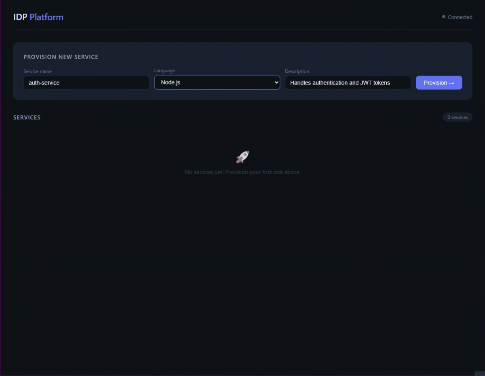

# IDP Platform — Internal Developer Platform

> A self-service platform that lets developers provision fully configured 
> microservices with a single API call — GitHub repo, Dockerfile, 
> Kubernetes deployment, all created automatically.

## Demo



## What it does

POST one request to `/api/services` and the platform automatically:

1. Creates a GitHub repository with the correct structure
2. Adds a Dockerfile and GitHub Actions CI pipeline
3. Deploys the service to Kubernetes (Deployment + Service + Ingress)
4. Streams real-time provisioning status back via SignalR

## Why I built this

Most teams waste hours setting up the same boilerplate every time they 
start a new service, creating a repo, writing a Dockerfile, configuring 
CI, setting up Kubernetes manifests. This platform automates all of that 
with a single API call.

I built it to understand how internal developer platforms like Backstage 
work under the hood, and to demonstrate that complex developer tooling 
can be built with clean, maintainable .NET code.

## Tech stack

| Layer | Technology |
|---|---|
| API | ASP.NET Core 9 |
| Database | PostgreSQL + Entity Framework Core |
| GitHub automation | Octokit.net (GitHub REST API) |
| Kubernetes automation | KubernetesClient |
| Real-time updates | SignalR |
| Logging | Serilog (structured JSON logs) |
| API docs | Scalar |

## Running locally

**Prerequisites:** .NET 9, Docker Desktop
```bash
# 1. Start the database
docker run -d \
  --name idp-postgres \
  -e POSTGRES_USER=idpuser \
  -e POSTGRES_PASSWORD=idppass \
  -e POSTGRES_DB=idpdb \
  -p 5432:5432 \
  postgres:16

# 2. Run the API
dotnet run --project src/Idp.Api

# 3. Open API docs
# http://localhost:5107/scalar/v1
```

## API endpoints

| Method | Endpoint | What it does |
|---|---|---|
| POST | `/api/services` | Provision a new service |
| GET | `/api/services` | List all services |
| GET | `/api/services/{id}` | Check provisioning status |

## Project structure

IdpPlatform/
├── src/
│   ├── Idp.Api/             # ASP.NET Core API — entry point
│   ├── Idp.Core/            # Domain models + interfaces
│   ├── Idp.Infrastructure/  # Database, EF Core, external clients
│   └── Idp.Worker/          # Background provisioning pipeline
└── README.md

## Status

| Task | Feature | Status |
|---|---|---|
| Task 1 | API skeleton + PostgreSQL + EF Core | ✅ Done |
| Task 2 | GitHub integration — auto repo + Dockerfile + CI | ✅ Done |
| Task 3 | Background worker + Kubernetes integration | ✅ Done |
| Task 4 | SignalR real-time status + dashboard UI | ✅ Done |